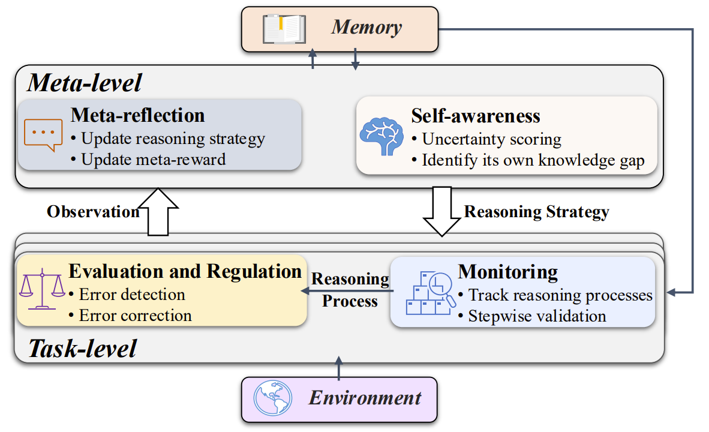
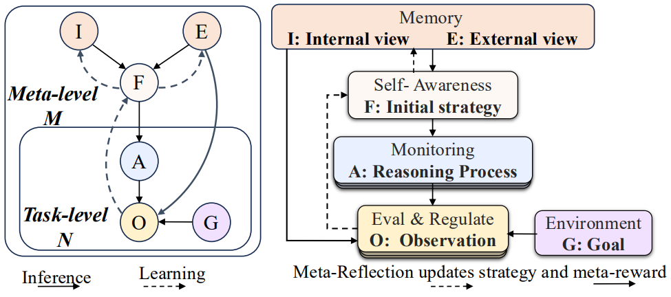
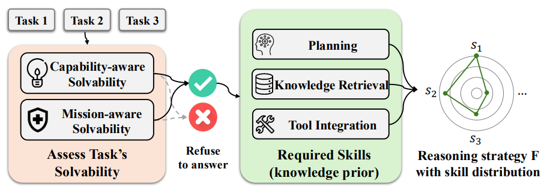
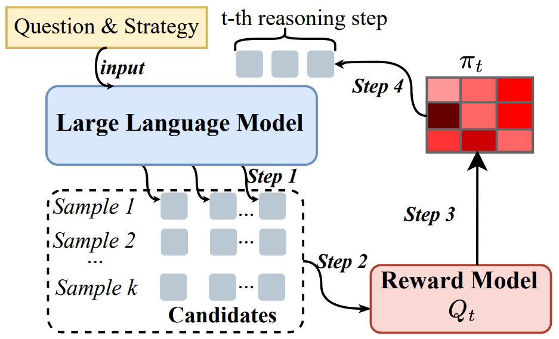
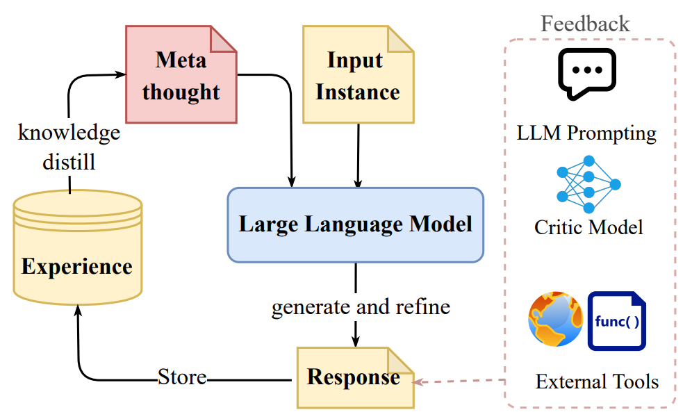

# Position: LLMs Need a Bayesian Meta-Reasoning Framework for More Robust and Generalizable Reasoning

> **Paper:** *Position: LLMs Need a Bayesian Meta-Reasoning Framework for More Robust and Generalizable Reasoning* (ICML 2025) [[link](https://kclpure.kcl.ac.uk/ws/portalfiles/portal/334828564/ICML25_MetaReasoning_CameraReady.pdf)]
 
---

## ✨ 1. Introduction
Large language models (LLMs) excel at pattern-completion yet often struggle with **reliable reasoning**—they hallucinate, over-generalise, or overshoot their reward signals.  
As shown in [Figure 1](#overview), the paper proposes a ***Bayesian meta-reasoning framework*** that equips an LLM with four interacting modules.

<figure id="overview", style="text-align: center;">
  
  <figcaption><b>Figure 1:</b> Overview of the framework.</figcaption>
</figure>

The core functions and key benefits of each module are listed as follows:

| Module | Core Function | Key Benefit |
|--------|---------------|-------------|
| **[🧠 Self-Awareness](#41-🧠-self-awareness)** | Judge whether it *can* and *should* solve a given task | Reduces overconfidence |
| **[🔍 Monitoring](#42-🔍-monitoring)** | Track intermediate steps via learnt rewards | Prevents reward hacking |
| **[✅ Evaluation & Regulation](#43-✅-evaluation-and-regulation)** | Critique and revise the answer chain | Improves answer quality |
| **[🔄 Meta-Reflection](#44-🔄-meta-reflection)** | Consolidate experience across tasks | Enables continual learning |


---

## ❓ 2. Open Problem

Large Language Models (LLMs) face several fundamental challenges in reasoning and decision-making. Below are four key open problems that motivate the need for a meta-reasoning framework:

- **🚨 Overconfidence** <a id="open-problem-1"></a>: 
  LLMs emit confident yet false answers.  
  **Solved by → [🧠 Self-Awareness](#41-🧠-self-awareness)**

- **🔗 Inflexible Strategy** <a id="open-problem-2"></a>: 
  Models rely on one-size-fits-all heuristics (e.g. chain-of-thought).  
  **Solved by → [🧠 Self-Awareness](#41-🧠-self-awareness), [🔍 Monitoring](#42-🔍-monitoring)**

- **🎯 Reward Misalignment** <a id="open-problem-3"></a>: 
  Static RLHF rewards are gamed, harming generalisation.  
  **Solved by → [🔍 Monitoring](#42-🔍-monitoring)**

- **📚 Knowledge Updating** <a id="open-problem-4"></a>: 
  Efficiently integrating new knowledge without forgetting remains hard.  
  **Solved by → [🔄 Meta-Reflection](#44-🔄-meta-reflection)**

---

## 🗺️ 3. Overall Framework

To achieve the aforementioned characteristics, we propose a Bayesian framework shown in [Figure 2](#bayesian):

* **🧠 Self-Awareness** estimates *task solvability* → initialises strategy `F` (addresses [🚨 Open 1](#open-problem-1), [🔗 Open 2](#open-problem-2)).  
* **🔍 Monitoring** executes `F`, scoring each step with a reward model (addresses [🔗 Open 2](#open-problem-2), [🎯 Open 3](#open-problem-3)).  
* **✅ Evaluation & Regulation** critiques results and corrects errors.  
* **🔄 Meta-Reflection** updates global priors `(I, E)` for future tasks (addresses [📚 Open 4](#open-problem-4)).  


<figure id="bayesian", style="text-align: center;">
  
  <figcaption><b>Figure 2:</b> The Bayesian framework with both task-level and meta-level components.</figcaption>
</figure>

---

## 🧩 4. Detailed Modules

### 🧠 4.1. Self-Awareness <a id="41-🧠-self-awareness"></a>
***Goal***: Judge **capability-aware** and **mission-aware** solvability before attempting.  
***Desirable Features***: calibrated confidence, OOD detection, principled refusal.  
***Research Gap***: existing calibration is single-view; no unified capability × mission model.
**Addresses** [🚨 Open 1](#open-problem-1) and [🔗 Open 2](#open-problem-2).


<figure style="text-align: center;">
  
  <figcaption><b>Figure 3:</b> The Self-awareness module.</figcaption>
</figure>


**Related work**:  

<table>
  <thead>
    <tr>
      <th style="text-align:center;">High-Level Category</th>
      <th style="text-align:center;">Sub-Category</th>
      <th style="text-align:center;">Method Type</th>
      <th style="text-align:center;">Representative Papers</th>
    </tr>
  </thead>
  <tbody>
    <tr>
      <td style="text-align:center;" rowspan="5"><strong>Uncertainty Estimation</strong></td>
      <td style="text-align:center;"><em>Real-Time</em></td>
      <td style="text-align:center;">Linguistic-based</td>
      <td style="text-align:center;">[Tian et al., 2023](https://arxiv.org/abs/2305.14975); [Mielke et al., 2022](https://arxiv.org/abs/2012.14983)</td>
    </tr>
    <tr>
      <td style="text-align:center;"><em>Real-Time</em></td>
      <td style="text-align:center;">Logit-based</td>
      <td style="text-align:center;">[Huang et al., 2023](https://arxiv.org/abs/2307.10236); [Duan et al., 2024](https://arxiv.org/abs/2307.01379)</td>
    </tr>
    <tr>
      <td style="text-align:center;"><em>Real-Time</em></td>
      <td style="text-align:center;">Internal-state-based</td>
      <td style="text-align:center;">[Kadavath et al., 2022](https://arxiv.org/abs/2207.05221); [Burns et al., 2023](https://arxiv.org/abs/2212.03827)</td>
    </tr>
    <tr>
      <td style="text-align:center;"><em>Post-hoc</em></td>
      <td style="text-align:center;">Consistency-based</td>
      <td style="text-align:center;">[Manakul et al., 2023](https://arxiv.org/abs/2303.08896)</td>
    </tr>
    <tr>
      <td style="text-align:center;"><em>Post-hoc</em></td>
      <td style="text-align:center;">Distribution-based</td>
      <td style="text-align:center;">[Catak et al., 2024](https://arxiv.org/abs/2406.19712); [Kuhn et al., 2023](https://arxiv.org/abs/2302.09664)</td>
    </tr>
    <tr>    
      <td style="text-align:center;" rowspan="2"><strong>Uncertainty Calibration</strong></td>
      <td style="text-align:center;">–</td>
      <td style="text-align:center;">Supervised-based</td>
      <td style="text-align:center;">[Liu et al., 2024](https://arxiv.org/abs/2404.15993); [Kapoor et al., 2024](https://arxiv.org/abs/2406.08391)</td>
    </tr>
    <tr>
      <td style="text-align:center;">–</td>
      <td style="text-align:center;">Prompting-based</td>
      <td style="text-align:center;">[Jiang et al., 2023](https://openreview.net/forum?id=L0dc4wqbNs#all); [Xiong et al., 2024](https://arxiv.org/abs/2306.13063)</td>
    </tr>
  </tbody>
</table>


---

### 🔍 4.2. Monitoring <a id="42-🔍-monitoring"></a>
***Goal***: Guide search with **step-level rewards** and adjust strategy on-the-fly.  
***Desirable Features***: fine-grained reward models, beam/MCTS integration.  
***Research Gap***: current rewards are noisy proxies; lack adaptive control.

<figure style="text-align: center;">
  
  <figcaption><b>Figure 4:</b> The Monitoring module.</figcaption>
</figure>

**Related work**:  
- [Let’s Verify Step by Step](https://arxiv.org/abs/2305.20050)  
- [ProcessBench: Identifying Process Errors in Mathematical Reasoning](https://arxiv.org/abs/2412.06559)  
- [Self-Evolving Curriculum for LLM Reasoning](https://arxiv.org/abs/2505.14970)  
- [Reasoning with Language Model is Planning with World Model](https://arxiv.org/abs/2305.14992)  


↳ **Addresses** [🔗 Open 2](#open-problem-2) and [🎯 Open 3](#open-problem-3).

---

### ✅ 4.3. Evaluation and Regulation <a id="43-✅-evaluation-and-regulation"></a>
***Goal***: Critique and refine the generated reasoning chain.  
***Desirable Features***: iterative self-critique, template-free feedback, meta-error analysis.  
***Research Gap***: today’s methods are instance-local and template-fixed.

<figure style="text-align: center;">
  
  <figcaption><b>Figure 5:</b> The Evaluation and Regulation module.</figcaption>
</figure>

**Related work**:  
- [Self-Refine: Iterative Refinement with Self-Feedback](https://arxiv.org/abs/2303.17651)  
- [PromptAgent: Strategic Planning with Language Models Enables Expert-level Prompt Optimization](https://arxiv.org/abs/2310.16427)  
- [Training Language Models to Self-Correct via Reinforcement Learning](https://arxiv.org/abs/2409.12917)  

↳ Complements [**🔍 Monitoring**](#42-🔍-monitoring); feeds [**🔄 Meta-Reflection**](#44-🔄-meta-reflection).

---

### 🔄 4.4. Meta-Reflection <a id="44-🔄-meta-reflection"></a>
***Goal***: Perform hierarchical Bayesian updates of knowledge priors `(I, E)` across tasks.  
***Desirable Features***: modular updates (adapters), latent strategy discovery, efficient consolidation.  
***Research Gap***: meta-templates rarely adapt; meta-updates are costly.

**Related work**:  
- [Model-Agnostic Meta-Learning for Fast Adaptation of Deep Networks](https://arxiv.org/abs/1703.03400)  
- [MetaICL: Learning to Learn In Context](https://arxiv.org/abs/2110.15943)  
- [Meta-learning via Language Model In-context Tuning](https://arxiv.org/abs/2110.07814)  
- [ReMA: Learning to Meta-think for LLMs with Multi-Agent Reinforcement Learning](https://arxiv.org/abs/2503.09501)  

↳ **Addresses** [📚 Open 4](#open-problem-4) and aggregates insights from all other modules.

---

## 🚀 5. Actionable Insights
| Insight | Linked Module(s) |
|---------|------------------|
| **Benchmark & Metrics** – build *SolvBench*, *AwareBench* to test meta-reasoning | 🧠 Self-Awareness, 🔄 Meta-Reflection |
| **Multi-View Solvability** – neuro-symbolic joint modelling | 🧠 Self-Awareness |
| **Adaptive Strategy Generation** – latent “plan-to-plan” learning | 🧠 Self-Awareness, 🔄 Meta-Reflection |
| **Self-Play for Meta-Rewards** – richer reward shaping | 🔍 Monitoring |
| **Latent-Space Reasoning** – reduce surface-level errors | ✅ Evaluation & Regulation, 🔄 Meta-Reflection |
| **Modular Meta-Training** – adapter banks for sub-skills | 🔄 Meta-Reflection |

By pursuing these insights, researchers can close the gaps identified in each module and realise a full Bayesian meta-reasoning LLM.

---

## 📖 Citation

If this work is helpful, please kindly cite as:

```bigquery
@inproceedings{yan2025position,
      title={Position: LLMs Need a Bayesian Meta-Reasoning Framework for More Robust and Generalizable Reasoning.},
      author={Hanqi Yan, Linhai Zhang, Jiazheng Li, Zhenyi Shen, and Yulan He},
      booktitle={Forty-second International Conference on Machine Learning},
      year={2025},
      url={https://kclpure.kcl.ac.uk/portal/en/publications/position-llms-need-a-bayesian-meta-reasoning-framework-for-more-r}
}
