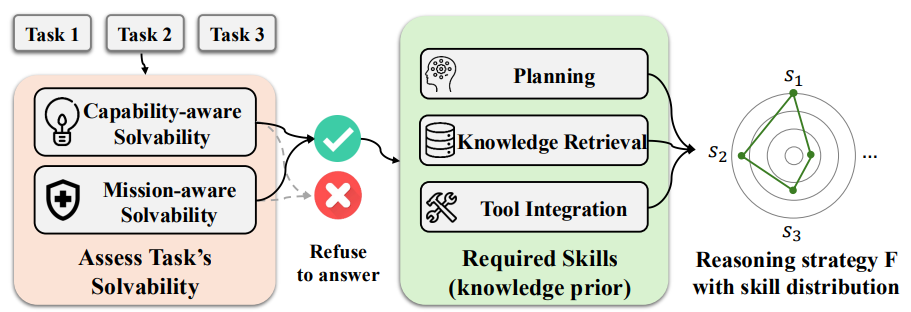

# Position: LLMs Need a Bayesian Meta-Reasoning Framework for More Robust and Generalizable Reasoning

> **Paper:** *Position: LLMs Need a Bayesian Meta-Reasoning Framework for More Robust and Generalizable Reasoning* (ICML 2025) [[link](https://kclpure.kcl.ac.uk/ws/portalfiles/portal/334828564/ICML25_MetaReasoning_CameraReady.pdf)]
 
---

## ✨ 1. Introduction
Large language models (LLMs) excel at pattern-completion yet often struggle with **reliable reasoning**—they hallucinate, over-generalise, or overshoot their reward signals.  
As shown in [Figure 1](#overview), the paper proposes a ***Bayesian meta-reasoning framework*** that equips an LLM with four interacting modules.

<p align="center">
  
</p>
<p align="center"><b>Figure 1:</b> Overview of the framework.</p>

The core functions and key benefits of each module are listed as follows:

| Module | Core Function | Key Benefit |
|--------|---------------|-------------|
| **[🧠 Self-Awareness](#41-🧠-self-awareness)** | Judge whether it *can* and *should* solve a given task, generate high-level reasoning strategy | Global control |
| **[🔍 Monitoring](#42-🔍-monitoring)** | Track intermediate reasoning steps using intrinsic rewards | Mitigate reward hacking |
| **[✅ Evaluation & Regulation](#43-✅-evaluation-and-regulation)** | Critique and revise the answer chain | Enable meta-thoughts for problem solving |
| **[🔄 Meta-Reflection](#44-🔄-meta-reflection)** | Consolidate multi-source knolwegde across tasks | Enables efficient and safe learning |


---

## ❓ 2. Open Problem

Large Language Models (LLMs) face several fundamental challenges in reasoning and decision-making. Below are four key open problems that motivate the need for a meta-reasoning framework:

- **🚨 Lack of self-awarenss in knowledge and ethics** <a id="open-problem-1"></a>: 
  LLMs emit confident yet false answers, fail to refuse unethical requests.  
  **Solved by → [🧠 Self-Awareness](#41-🧠-self-awareness)**

- **🔗 Inflexible Strategy** <a id="open-problem-2"></a>: 
  Models rely on one-size-fits-all heuristics (e.g. chain-of-thought).  
  **Solved by → [🧠 Self-Awareness](#41-🧠-self-awareness), [🔍 Monitoring](#42-🔍-monitoring)**

- **🎯 Reward Misalignment** <a id="open-problem-3"></a>: 
  Static RLHF rewards are gamed, harming generalisation.  
  **Solved by → [🔍 Monitoring](#42-🔍-monitoring)**

- **📚 Knowledge Updating** <a id="open-problem-4"></a>: 
  Efficiently integrating new knowledge in inference and training.  
  **Solved by → [✅ Evaluation & Regulation](#43-✅-evaluation-and-regulation), [🔄 Meta-Reflection](#44-🔄-meta-reflection),**

---

## 🗺️ 3. Overall Framework

To achieve the aforementioned characteristics, we propose a Bayesian framework shown in [Figure 2](#bayesian):

* **🧠 Self-Awareness** estimates *task solvability* → initialises strategy `F` (addresses [🚨 Open 1](#open-problem-1), [🔗 Open 2](#open-problem-2)).  
* **🔍 Monitoring** executes `F`, scoring each step with a reward model (addresses [🔗 Open 2](#open-problem-2), [🎯 Open 3](#open-problem-3)).  
* **✅ Evaluation & Regulation** critiques results and corrects errors.  (addresses [📚 Open 4](#open-problem-4))
* **🔄 Meta-Reflection** updates global priors `(I, E)` for future tasks (addresses [📚 Open 4](#open-problem-4)).  


<a id="bayesian"></a>
<p align="center">
  
</p>
<p align="center"><b>Figure 2:</b> The Bayesian framework with both task-level and meta-level components.</p>


---

## 🧩 4. Detailed Modules

### 🧠 4.1. Self-Awareness <a id="41-🧠-self-awareness"></a>
***Goal***: Judge **capability-aware** and **mission-aware** solvability before attempting.  
***Desirable Features***: calibrated confidence, OOD detection, principled refusal.  
***Research Gap***: existing calibration is single-view; no unified capability × mission model.
**Addresses** [🚨 Open 1](#open-problem-1) and [🔗 Open 2](#open-problem-2).


<p align="center">
  
</p>
<p align="center"><b>Figure 3:</b> The Self-Awareness module.</p>


##### Related work:  

<table>
  <thead>
    <tr>
      <th style="text-align:center;">High-Level Category</th>
      <th style="text-align:center;">Sub-Category</th>
      <th style="text-align:center;">Method Type</th>
      <th style="text-align:center;">Representative Papers</th>
    </tr>
  </thead>
  <tbody>
    <tr>
      <td style="text-align:center;" rowspan="5"><strong>Uncertainty Estimation</strong></td>
      <td style="text-align:center;"><em>Real-Time</em></td>
      <td style="text-align:center;">Linguistic-based</td>
      <td style="text-align:center;">
        <a href="https://arxiv.org/abs/2305.14975">Tian et al., 2023</a>; 
        <a href="https://arxiv.org/abs/2012.14983">Mielke et al., 2022</a>
      </td>
    </tr>
    <tr>
      <td style="text-align:center;"><em>Real-Time</em></td>
      <td style="text-align:center;">Logit-based</td>
      <td style="text-align:center;">
        <a href="https://arxiv.org/abs/2307.10236">Huang et al., 2023</a>; 
        <a href="https://arxiv.org/abs/2307.01379">Duan et al., 2024</a>
      </td>
    </tr>
    <tr>
      <td style="text-align:center;"><em>Real-Time</em></td>
      <td style="text-align:center;">Internal-state-based</td>
      <td style="text-align:center;">
        <a href="https://arxiv.org/abs/2207.05221">Kadavath et al., 2022</a>; 
        <a href="https://arxiv.org/abs/2212.03827">Burns et al., 2023</a>
      </td>
    </tr>
    <tr>
      <td style="text-align:center;"><em>Post-hoc</em></td>
      <td style="text-align:center;">Consistency-based</td>
      <td style="text-align:center;">
        <a href="https://arxiv.org/abs/2303.08896">Manakul et al., 2023</a>
      </td>
    </tr>
    <tr>
      <td style="text-align:center;"><em>Post-hoc</em></td>
      <td style="text-align:center;">Distribution-based</td>
      <td style="text-align:center;">
        <a href="https://arxiv.org/abs/2406.19712">Catak et al., 2024</a>; 
        <a href="https://arxiv.org/abs/2302.09664">Kuhn et al., 2023</a>
      </td>
    </tr>
    <tr>
      <td style="text-align:center;" rowspan="2"><strong>Uncertainty Calibration</strong></td>
      <td style="text-align:center;">–</td>
      <td style="text-align:center;">Supervised-based</td>
      <td style="text-align:center;">
        <a href="https://arxiv.org/abs/2404.15993">Liu et al., 2024</a>; 
        <a href="https://arxiv.org/abs/2406.08391">Kapoor et al., 2024</a>
      </td>
    </tr>
    <tr>
      <td style="text-align:center;">–</td>
      <td style="text-align:center;">Prompting-based</td>
      <td style="text-align:center;">
        <a href="https://openreview.net/forum?id=L0dc4wqbNs#all">Jiang et al., 2023</a>; 
        <a href="https://arxiv.org/abs/2306.13063">Xiong et al., 2024</a>
      </td>
    </tr>
  </tbody>
</table>

##### Actionable insights 

:warning:A unified framework that integrates multi-aspect task solvability—including factors beyond knowledge boundaries and ethical considerations—such as prioritizing efficiency or addressing constraints for specific user groups (e.g., teenagers). 

:rocket: This paves the way for a promising future direction: a neuro-symbolic system capable of **accurately** synthesizing multiple aspects into a coherent whole.

[Logical Reasoning in Large Language Models: A Survey](https://arxiv.org/pdf/2502.09100) 2025
[Chain of Logic: Rule-Based Reasoning with Large Language Models](https://arxiv.org/abs/2402.10400) 2024

---

### 🔍 4.2. Monitoring <a id="42-🔍-monitoring"></a>
***Goal***: Guide search with **step-level rewards** and adjust strategy on-the-fly.  
***Desirable Features***: fine-grained reward models, beam/MCTS integration.  
***Research Gap***: current rewards are noisy proxies; lack adaptive control.

<p align="center">
  
</p>
<p align="center"><b>Figure 4:</b> The Monitoring module.</p>

#### Related work  

<table>
  <thead>
    <tr>
      <th style="text-align:center;">Reward Granularity</th>
      <th style="text-align:center;">Rewards Type</th>
      <th style="text-align:center;">Reward Source</th>
      <th style="text-align:center;">Training Algorithms</th>
      <th style="text-align:center;">Representative Papers</th>
    </tr>
  </thead>
  <tbody>
    <tr>
      <td style="text-align:center;">Outcome-level</td>
      <td style="text-align:center;">Preference</td>
      <td style="text-align:center;">Modelled</td>
      <td style="text-align:center;">SFT + (DPO / PPO / GRPO)</td>
      <td style="text-align:left;">
        <a href="https://arxiv.org/abs/2203.02155">Ouyang et al.</a>, 
        <a href="https://arxiv.org/abs/2407.21783">Meta et al.</a>, 
        <a href="https://arxiv.org/abs/2412.15115">Qwen et al.</a>
      </td>
    </tr>
    <tr>
      <td style="text-align:center;">Outcome-level</td>
      <td style="text-align:center;">Correctness, Format</td>
      <td style="text-align:center;">Groundtruth</td>
      <td style="text-align:center;">GRPO</td>
      <td style="text-align:left;">
        <a href="https://arxiv.org/abs/2501.12948">Deepseek et al.</a>
      </td>
    </tr>
    <tr>
      <td style="text-align:center;">Outcome-level</td>
      <td style="text-align:center;">Energy</td>
      <td style="text-align:center;">–</td>
      <td style="text-align:center;">SFT + PPO</td>
      <td style="text-align:left;">
        <a href="https://arxiv.org/abs/2504.13134">Lochab et al.</a>
      </td>
    </tr>
    <tr>
      <td style="text-align:center;" rowspan="3">Process-level</td>
      <td style="text-align:center;" rowspan="3">Correctness</td>
      <td style="text-align:center;" rowspan="3">Modelled</td>
      <td style="text-align:center;">SFT</td>
      <td style="text-align:left;">
        <a href="https://arxiv.org/abs/2405.03553">Chen et al.</a>, 
        <a href="https://arxiv.org/abs/2309.17179">Feng et al.</a>
      </td>
    </tr>
    <tr>
      <td style="text-align:center;">SFT + (PPO / GRPO)</td>
      <td style="text-align:left;">
        <a href="https://arxiv.org/abs/2402.03300">Shao et al.</a>, 
        <a href="https://arxiv.org/abs/2312.08935">Wang et al.</a>
      </td>
    </tr>
    <tr>
      <td style="text-align:center;">SFT + DPO</td>
      <td style="text-align:left;">
        <a href="https://arxiv.org/abs/2406.09136">Zhang et al.</a>, 
        <a href="https://arxiv.org/abs/2405.00451">Xie et al.</a>, 
        <a href="https://arxiv.org/abs/2406.10858">Chen et al.</a>
      </td>
    </tr>
  </tbody>
</table>

##### Actioanable insights

:warning: Verified reward, preteained reward model, or using LLM-as-a-Judge have notable limitations: they often overlook reasoning diversity, rely on expensive human annotation, not reliable, not adaptive to changing environments. 

We believe a **self-play system**, where the evaluator is an evolving agent and the feedback is based on **internal signals**, offers a promising alternative. This approach has proven to be faithful, controllable, and efficient; also compressing the reasoning trajectories into the latent space can improve the reasoning robust via avoiding superficial alignment.

🚀 self-play system
[A survey on self-evolution of large language models.](https://arxiv.org/abs/2404.14387)
[Self-Play Preference Optimization for Language Model Alignment](https://arxiv.org/abs/2405.00675)

🚀 reward in latent space
[Reasoning Models Don't Always Say What They Think](https://arxiv.org/abs/2505.05410) 2025. Alignment Science Team, Anthropic
[Soft Reasoning: Navigating Solution Spaces in Large Language Models through Controlled Embedding Exploration](https://arxiv.org/abs/2505.24688) ICML25, spotlight
[Latent Space Chain-Of-Embedding Enables Output-Free Llm Self-Evaluation](https://arxiv.org/abs/2410.13640). ICLR25
[Learning to Reason without External Rewards](https://arxiv.org/abs/2505.19590) 2025

🚀 Compress reasoning trajectories in latent space
[Training Large Language Models to Reason in a Continuous Latent Space](https://arxiv.org/abs/2412.06769)
[CODI: Compressing Chain-of-Thought into Continuous Space via Self-Distillation](https://arxiv.org/abs/2502.21074)

↳ **Addresses** [🔗 Open 2](#open-problem-2) and [🎯 Open 3](#open-problem-3).

---

### ✅ 4.3. Evaluation and Regulation <a id="43-✅-evaluation-and-regulation"></a>
***Goal***: Critique and refine the generated reasoning chain.  
***Desirable Features***: iterative self-critique, template-free feedback, meta-error analysis.  
***Research Gap***: today’s methods are instance-local and template-fixed.

<p align="center">
  
</p>
<p align="center"><b>Figure 5:</b> The Evaluation and Regulation module.</p>

**Related work**:  

<table>
  <thead>
    <tr>
      <th style="text-align:center;">Aspect</th>
      <th style="text-align:center;">Category / Technique</th>
      <th style="text-align:center;">Representative Papers (chronological)</th>
      <th style="text-align:center;">Key idea</th>
      <th style="text-align:center;">Noted gaps / limits</th>
    </tr>
  </thead>
  <tbody>
    <!-- Evaluation block --------------------------------------------------->
    <tr>
      <td style="text-align:center;" rowspan="5"><strong>Evaluation<br>(generating feedback on a full reasoning chain)</strong></td>
      <td style="text-align:center;"><strong>Template-based verbal feedback</strong></td>
      <td style="text-align:left;">
        <a href="https://arxiv.org/abs/2303.17651">Self-Refine (Madaan&nbsp;23)</a>,&nbsp;
        <a href="https://openreview.net/forum?id=22pyNMuIoa">PromptAgent (Wang&nbsp;24d)</a>,&nbsp;
        <a href="https://arxiv.org/pdf/2311.08516">LLM-CF (Tyen&nbsp;23)</a>,&nbsp;
        <a href="https://arxiv.org/abs/2403.04222">Self-Eval&nbsp;LargeLM (Huang&nbsp;24b)</a>
      </td>
      <td style="text-align:left;">Use canned prompt templates that ask the model to critique its own output.</td>
      <td style="text-align:left;">Feedback is often shallow and template rigidity limits coverage.</td>
    </tr>
    <tr>
      <td style="text-align:center;"><strong>Critic-model feedback</strong></td>
      <td style="text-align:left;">
        <a href="https://arxiv.org/abs/2406.10858">Step-Level Preference (Chen&nbsp;24b)</a>,&nbsp;
        <a href="https://arxiv.org/abs/2409.12917">Self-Correct (Kumar&nbsp;24)</a>,&nbsp;
        <a href="https://arxiv.org/abs/2403.20046">Learning-from-Mistakes (Tong&nbsp;24)</a>,&nbsp;
        <a href="https://arxiv.org/abs/2211.14275">Math&nbsp;Error&nbsp;Loc (Uesato&nbsp;22)</a>,&nbsp;
        <a href="https://arxiv.org/pdf/2304.01904">REFINER (Paul&nbsp;24)</a>,&nbsp;
        <a href="https://arxiv.org/pdf/2502.19230">DARS (Li&nbsp;25a)</a>
      </td>
      <td style="text-align:left;">Train a separate classifier/regressor that labels wrong steps.</td>
      <td style="text-align:left;">High annotation cost; critics may localise but not explain errors clearly.</td>
    </tr>
    <tr>
      <td style="text-align:center;"><strong>Token-based back-tracking</strong></td>
      <td style="text-align:left;">
        <a href="https://arxiv.org/pdf/2409.14586">Backtracking (Zhang&nbsp;25a)</a>,&nbsp;
        <a href="https://arxiv.org/abs/2403.09629">Quiet-STaR (Zelikman&nbsp;24)</a>
      </td>
      <td style="text-align:left;">Add special tokens such as <code>[RESET]</code> to let the model roll back and try again.</td>
      <td style="text-align:left;">Still relies on the base model’s willingness to revise.</td>
    </tr>
    <tr>
      <td style="text-align:center;"><strong>Tool-assisted feedback</strong></td>
      <td style="text-align:left;">
        <em>Code tools&nbsp;—</em>
        <a href="https://arxiv.org/abs/2305.04087">Self-Edit (Zhang&nbsp;23a)</a>,&nbsp;
        <a href="https://openreview.net/forum?id=KuPixIqPiq">Self-Debug (Chen&nbsp;24c)</a>,&nbsp;
        <a href="https://arxiv.org/pdf/2305.11738">CRITIC (Gou&nbsp;24)</a>,&nbsp;
        <a href="https://arxiv.org/pdf/2504.11536">ReTool (Feng&nbsp;25a)</a>,&nbsp;
        <a href="https://arxiv.org/abs/2504.13958">ToolRL (Qian&nbsp;25)</a><br>
        <em>Search engines&nbsp;—</em>
        <a href="https://arxiv.org/abs/2210.03629">ReAct (Yao&nbsp;23b)</a>,&nbsp;
        <a href="https://arxiv.org/abs/2302.12813">Check-Facts (Peng&nbsp;23)</a>,&nbsp;
        <a href="https://arxiv.org/abs/2503.09516">Search-R1 (Jin&nbsp;25)</a>,&nbsp;
        <a href="https://arxiv.org/pdf/2503.05592">R1-Searcher (Song&nbsp;25)</a><br>
        <em>Logic / topology&nbsp;—</em>
        <a href="https://arxiv.org/pdf/2505.13890">Graph-Analyser (Zhang&nbsp;23b)</a>
      </td>
      <td style="text-align:left;">Call external solvers (code interpreters, web searchers, graph tools) to ground or verify intermediate results.</td>
      <td style="text-align:left;">Coverage limited to domains where reliable tools exist.</td>
    </tr>
    <tr>
      <td style="text-align:center;"><strong>Pattern-level / multi-instance feedback</strong></td>
      <td style="text-align:left;">
        <a href="https://arxiv.org/abs/2502.06772">Thought-Templates (Yang&nbsp;25a)</a>,&nbsp;
        <a href="https://arxiv.org/abs/2406.04271">Meta-Buffer (Yang&nbsp;24)</a>,&nbsp;
        <a href="https://aclanthology.org/2024.findings-acl.34.pdf">Semantic-Symbol Prompts (Wang&nbsp;24g)</a>
      </td>
      <td style="text-align:left;">Cluster similar queries, evaluate common error patterns rather than one-off instances.</td>
      <td style="text-align:left;">Still handcrafted; relies on LLM compliance with structured templates.</td>
    </tr>
    <!-- Regulation block --------------------------------------------------->
    <tr>
      <td style="text-align:center;" rowspan="4"><strong>Regulation<br>(using feedback to repair reasoning)</strong></td>
      <td style="text-align:center;"><strong>Direct self-reflection prompting</strong></td>
      <td style="text-align:left;">
        <a href="https://arxiv.org/abs/2303.17651">Self-Refine (Madaan&nbsp;23)</a>,&nbsp;
        <a href="https://arxiv.org/abs/2406.10400">Self-Reflection Makes LLMs Safer (Liu&nbsp;24)</a>
      </td>
      <td style="text-align:left;">Feed critique back to the same model and ask it to revise its answer.</td>
      <td style="text-align:left;">LLMs can be “stubborn” and ignore corrections.</td>
    </tr>
    <tr>
      <td style="text-align:center;"><strong>Gradient-through-text (TextGrad)</strong></td>
      <td style="text-align:left;">
        <a href="https://arxiv.org/abs/2406.07496">TextGrad (Yuksekgonul&nbsp;25)</a>
      </td>
      <td style="text-align:left;">Treat natural-language feedback as a gradient signal and refine the prompt.</td>
      <td style="text-align:left;">Requires differentiable proxy; early-stage research.</td>
    </tr>
    <tr>
      <td style="text-align:center;"><strong>Explicit error-correction trajectories</strong></td>
      <td style="text-align:left;">
        <a href="https://arxiv.org/abs/2403.09629">Quiet-STaR (Zelikman&nbsp;24)</a>,&nbsp;
        <a href="https://arxiv.org/pdf/2409.14586">Backtracking (Zhang&nbsp;25a)</a>
      </td>
      <td style="text-align:left;">Train on pairs (wrong chain → fixed chain) so the model learns how to patch errors.</td>
      <td style="text-align:left;">May over-fit to surface patterns.</td>
    </tr>
    <tr>
      <td style="text-align:center;"><strong>‘Think-mode’ time-outs</strong></td>
      <td style="text-align:left;">
        <a href="https://arxiv.org/pdf/2501.12948">DeepSeek-R1 “think” mode (Chen&nbsp;25)</a>
      </td>
      <td style="text-align:left;">Insert a deliberate wait to encourage an extra round of internal checks before answering.</td>
      <td style="text-align:left;">Can introduce over-thinking latency.</td>
    </tr>
  </tbody>
</table>

**Actioanable insights**:

(a) new benchmark with feedback and required skills annotation.

(b) Retrieve surrogate samples for reasoning inspiration.

↳ Complements [**🔍 Monitoring**](#42-🔍-monitoring); feeds [**🔄 Meta-Reflection**](#44-🔄-meta-reflection).

---

### 🔄 4.4. Meta-Reflection <a id="44-🔄-meta-reflection"></a>
***Goal***: Perform hierarchical Bayesian updates of knowledge priors `(I, E)` across tasks.  
***Desirable Features***: modular updates (adapters), latent strategy discovery, efficient consolidation.  
***Research Gap***: meta-templates rarely adapt; meta-updates are costly.

**Related work**:  
(a) meta-prompt optimisation
- [Model-Agnostic Meta-Learning for Fast Adaptation of Deep Networks](https://arxiv.org/abs/1703.03400)  
- [MetaICL: Learning to Learn In Context](https://arxiv.org/abs/2110.15943)  
- [Meta-learning via Language Model In-context Tuning](https://arxiv.org/abs/2110.07814)
  
(b) LoRA decomposition

(c) multi-agent RL
- [ReMA: Learning to Meta-think for LLMs with Multi-Agent Reinforcement Learning](https://arxiv.org/abs/2503.09501)
  
(d) Bayesian Inverse Planning


**Actioanable insights**:

(a) Mechanistic interpretability for safe training and adaptation

(b) multi-objective learning


↳ **Addresses** [📚 Open 4](#open-problem-4) and aggregates insights from all other modules.

---

## 🚀 5. Actionable Insights
| Insight | Linked Module(s) |
|---------|------------------|
| **Benchmark & Metrics** – build *SolvBench*, *AwareBench* to test meta-reasoning | 🧠 Self-Awareness, 🔄 Meta-Reflection |
| **Multi-View Solvability** – neuro-symbolic joint modelling | 🧠 Self-Awareness |
| **Adaptive Strategy Generation** – latent “plan-to-plan” learning | 🧠 Self-Awareness, 🔄 Meta-Reflection |
| **Self-Play for Meta-Rewards** – richer reward shaping | 🔍 Monitoring |
| **Latent-Space Reasoning** – reduce surface-level errors | ✅ Evaluation & Regulation, 🔄 Meta-Reflection |
| **Modular Meta-Training** – adapter banks for sub-skills | 🔄 Meta-Reflection |

By pursuing these insights, researchers can close the gaps identified in each module and realise a full Bayesian meta-reasoning LLM.

---

## 📖 Citation

If this work is helpful, please kindly cite as:

```bigquery
@inproceedings{yan2025position,
      title={Position: LLMs Need a Bayesian Meta-Reasoning Framework for More Robust and Generalizable Reasoning.},
      author={Hanqi Yan, Linhai Zhang, Jiazheng Li, Zhenyi Shen, and Yulan He},
      booktitle={Forty-second International Conference on Machine Learning},
      year={2025},
      url={https://kclpure.kcl.ac.uk/portal/en/publications/position-llms-need-a-bayesian-meta-reasoning-framework-for-more-r}
}
