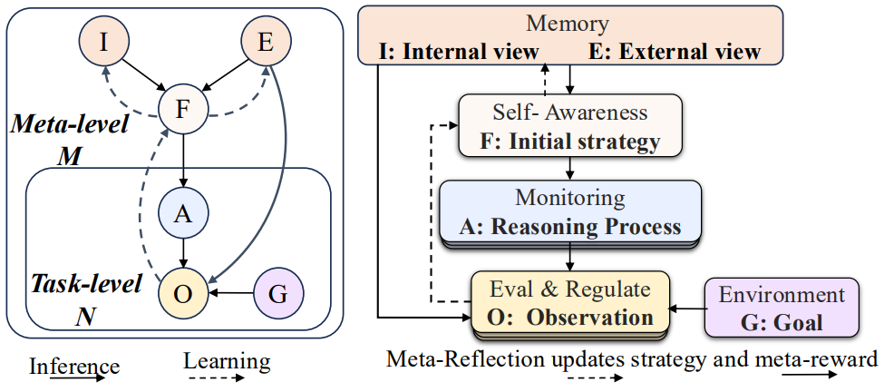
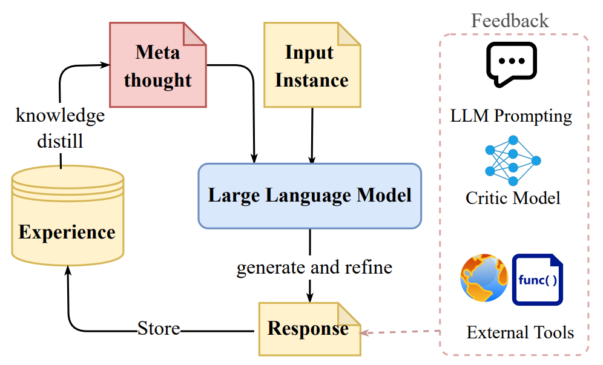

# Position: LLMs Need a Bayesian Meta-Reasoning Framework for More Robust and Generalizable Reasoning

> **Paper:** *Position: LLMs Need a Bayesian Meta-Reasoning Framework for More Robust and Generalizable Reasoning* (ICML 2025) [[link](https://openreview.net/pdf?id=RrvhbxO2hd)]
 
---

## ❓ 1. Open Problem

Large Language Models (LLMs) face several fundamental challenges in reasoning and decision-making. Below are four key open problems that motivate the need for a meta-reasoning framework:

- **🚨 Lack of self-awarenss in knowledge and ethics** <a id="open-problem-1"></a>: 
  LLMs often exhibit a strong *“Feeling of Knowing”* but lack crucial human-like cognitive attributes, such as *“awareness of limitations”* and “awareness of situation”.

 
- **🔗 Inflexible Strategy** <a id="open-problem-2"></a>: 
  LLMs lack of a flexible reasoning strategy for different individual problems, such as overthinking for simple questions; inefficiency of coordinating diverse tools in different reasoning phases. 

- **🎯 Reward Hacking** <a id="open-problem-3"></a>: 
 Reasoning agents exploit flaws in the reward function to achieve high scores without genuinely learning transferable reasoning patterns.

- **📚 Knowledge Updating** <a id="open-problem-4"></a>: 
Current on-the-fly knowledge retrieval or fine-tuning fails to adequately address the knowledge conflicts and resource inefficiency, especially when we need to inject multi-source knowledge.  

---


## ✨ 2. Overall Framework
Large language models (LLMs) excel at pattern-completion yet often struggle with **reliable reasoning**—they hallucinate, over-generalise, or overshoot their reward signals.  
As shown in [Figure 1](#overview), the paper proposes a ***Bayesian meta-reasoning framework*** that equips an LLM with four interacting modules.

<p align="center">
  
</p>
<p align="center"><b>Figure 1:</b> Overview of the framework.</p>

<!--
The core functions and key benefits of each module are listed as follows:

| Module | Core Function | Key Benefit |
|--------|---------------|-------------|
| **[🧠 Self-Awareness](#41-🧠-self-awareness)** | Judge whether it *can* and *should* solve a given task, generate high-level reasoning strategy | Global control |
| **[🔍 Monitoring](#42-🔍-monitoring)** | Track intermediate reasoning steps using intrinsic rewards | Mitigate reward hacking |
| **[✅ Evaluation & Regulation](#43-✅-evaluation-and-regulation)** | Critique and revise the answer chain | Enable meta-thoughts for problem solving |
| **[🔄 Meta-Reflection](#44-🔄-meta-reflection)** | Consolidate multi-source knolwegde across tasks | Enables efficient and safe learning |
-->

#### How can these modules alleviate the above limitations?

* **🧠 Self-Awareness**
  - Establish a unified framework to measure *task solvability* before conducting the reasoning step generation
  - Outputs an initial adaptive strategy `F` for adaptive reasoning
  - Addresses [🚨 Open 1](#open-problem-1), [🔗 Open 2](#open-problem-2)).  
* **🔍 Monitoring**
  - Given the initial reasoning strategy, verifying each reasoning step
  - Evaluate the intermediate reasoning process with intrinsic and dynamic reward
  - Addresses [🔗 Open 2](#open-problem-2), [🎯 Open 3](#open-problem-3).  
* **✅ Evaluation & Regulation**
  - Critiques the completed reasoning process and corrects errors
  - Incorporate knowledge with help from surrogate samples sharing the latent reasoning process.
  - Addresses [📚 Open 4](#open-problem-4))
* **🔄 Meta-Reflection**
  - Updates the model parameter and initial reasoning strategy 
  - Utilise the meta-observations across multiple samples and address the knowledge conflicts
  - Addresses [🔗 Open 2](#open-problem-2)[📚 Open 4](#open-problem-4)).  

<!--
<a id="bayesian"></a>
<p align="center">
  
</p>
<p align="center"><b>Figure 2:</b> The Bayesian framework with both task-level and meta-level components.</p>
-->

---

## 🧩 3. Literature review with actionable insights

We explain each component with existing literature as supporting, also actionable insights for next-step research actions. 

### 🧠 3.1. Self-Awareness <a id="41-🧠-self-awareness"></a>
***Goal***: 
- (1) Calculate the **task sovability** before attempting;
- (2) generate an initial reasoning strategy based on latent skills

<p align="center">
  
</p>
<p align="center"><b>Figure 3:</b> The Self-Awareness module.</p>

#### Related work:  
Existing studies focus on capability-awareness, i.e., confidence/uncertainty measurement, or mission-awareness. 

<table>
  <thead>
    <tr>
      <th style="text-align:center;">High-Level Category</th>
      <th style="text-align:center;">Sub-Category</th>
      <th style="text-align:center;">Method Type</th>
      <th style="text-align:center;">Representative Papers</th>
    </tr>
  </thead>
  <tbody>
    <tr>
      <td style="text-align:center;" rowspan="5"><strong>Uncertainty Estimation</strong></td>
      <td style="text-align:center;"><em>Real-Time</em></td>
      <td style="text-align:center;">Linguistic-based</td>
      <td style="text-align:center;">
        <a href="https://arxiv.org/abs/2305.14975">Tian et al., 2023</a>; 
        <a href="https://arxiv.org/abs/2012.14983">Mielke et al., 2022</a>
      </td>
    </tr>
    <tr>
      <td style="text-align:center;"><em>Real-Time</em></td>
      <td style="text-align:center;">Logit-based</td>
      <td style="text-align:center;">
        <a href="https://arxiv.org/abs/2307.10236">Huang et al., 2023</a>; 
        <a href="https://arxiv.org/abs/2307.01379">Duan et al., 2024</a>
      </td>
    </tr>
    <tr>
      <td style="text-align:center;"><em>Real-Time</em></td>
      <td style="text-align:center;">Internal-state-based</td>
      <td style="text-align:center;">
        <a href="https://arxiv.org/abs/2207.05221">Kadavath et al., 2022</a>; 
        <a href="https://arxiv.org/abs/2212.03827">Burns et al., 2023</a>
      </td>
    </tr>
    <tr>
      <td style="text-align:center;"><em>Post-hoc</em></td>
      <td style="text-align:center;">Consistency-based</td>
      <td style="text-align:center;">
        <a href="https://arxiv.org/abs/2303.08896">Manakul et al., 2023</a>
      </td>
    </tr>
    <tr>
      <td style="text-align:center;"><em>Post-hoc</em></td>
      <td style="text-align:center;">Distribution-based</td>
      <td style="text-align:center;">
        <a href="https://arxiv.org/abs/2406.19712">Catak et al., 2024</a>; 
        <a href="https://arxiv.org/abs/2302.09664">Kuhn et al., 2023</a>
      </td>
    </tr>
    <tr>
      <td style="text-align:center;" rowspan="2"><strong>Uncertainty Calibration</strong></td>
      <td style="text-align:center;">–</td>
      <td style="text-align:center;">Supervised-based</td>
      <td style="text-align:center;">
        <a href="https://arxiv.org/abs/2404.15993">Liu et al., 2024</a>; 
        <a href="https://arxiv.org/abs/2406.08391">Kapoor et al., 2024</a>
      </td>
    </tr>
    <tr>
      <td style="text-align:center;">–</td>
      <td style="text-align:center;">Prompting-based</td>
      <td style="text-align:center;">
        <a href="https://openreview.net/forum?id=L0dc4wqbNs#all">Jiang et al., 2023</a>; 
        <a href="https://arxiv.org/abs/2306.13063">Xiong et al., 2024</a>
      </td>
    </tr>
  </tbody>
</table>

To Linhai: Add a table summarizing the paper about mission awareness

#### Actionable insights 

:warning: A unified framework that integrates multi-aspect task solvability—including factors beyond knowledge boundaries and ethical considerations—such as prioritizing efficiency or addressing constraints for specific user groups (e.g., teenagers). 

- [Logical Reasoning in Large Language Models: A Survey](https://arxiv.org/pdf/2502.09100) 2025
- [Chain of Logic: Rule-Based Reasoning with Large Language Models](https://arxiv.org/abs/2402.10400) 2024

:warning: Lack of adaptability in diverse latent skills selection.

To Linhai: Add a list of papers using latent skills to generate an initial strategy, can be general to incorpoate similar cases as new context, as long as this step is before the actual reasoning step generation.

- [LaRS: Latent Reasoning Skills for Chain-of-Thought Reasoning](https://arxiv.org/abs/2312.04684) 2025 

---

### 🔍 3.2. Monitoring <a id="42-🔍-monitoring"></a>
***Goal***: Guide search with step-level intrinsic, faithful, dynamic and efficient rewards to alleviate reward hacking problem

<p align="center">
  
</p>
<p align="center"><b>Figure 4:</b> The Monitoring module.</p>

#### Related work  

To Zhenyi: Add a table summarizing the papers using the three methods during training. 

<table>
  <thead>
    <tr>
      <th style="text-align:center;">Reward Type</th>
      <th style="text-align:center;">Granularity</th>
      <th style="text-align:center;">Representative Papers</th>
    </tr>
  </thead>
  <tbody>
    <tr>
      <td style="text-align:center;" rowspan="2"><strong>Trained Reward Model</strong></td>
      <td style="text-align:center;"><em>Outcome level</em></td>
      <td style="text-align:center;">
        <a href="https://arxiv.org/abs/2203.02155">Ouyang et al.</a>; 
        <a href="https://arxiv.org/abs/2407.21783">Meta et al.</a>; 
        <a href="https://arxiv.org/abs/2412.15115">Qwen et al.</a>
      </td>
    </tr>
    <tr>
      <td style="text-align:center;"><em>Process level</em></td>
      <td style="text-align:center;">
        <a href="https://arxiv.org/abs/2402.03300">Shao et al.</a>; 
        <a href="https://arxiv.org/abs/2312.08935">Wang et al.</a>; 
        <a href="https://arxiv.org/abs/2405.00451">Xie et al.</a>
      </td>
    </tr>
    <tr>
      <td style="text-align:center;"><strong>LLM as a Judge</strong></td>
      <td style="text-align:center;"><em>Outcome level</em></td>
      <td style="text-align:center;">
        <a href="https://arxiv.org/abs/2401.10020">Yuan et al.</a>; 
        <a href="https://arxiv.org/abs/2505.10320">Whitehouse et al.</a>
      </td>
    </tr>
    <tr>
      <td style="text-align:center;"><strong>Verifiable Reward</strong></td>
      <td style="text-align:center;"><em>Outcome level</em></td>
      <td style="text-align:center;">
        <a href="https://arxiv.org/abs/2501.12948">Deepseek et al.</a>; 
        <a href="https://arxiv.org/abs/2307.04349">Liu et al.</a>; 
        <a href="https://arxiv.org/abs/2503.23829">Su et al.</a>
      </td>
    </tr>
  </tbody>
</table>

**Verifiable reward**

**Trained Reward Model**

**LLM as a Judge**

<!--
<table>
  <thead>
    <tr>
      <th style="text-align:center;">Reward Granularity</th>
      <th style="text-align:center;">Rewards Type</th>
      <th style="text-align:center;">Reward Source</th>
      <th style="text-align:center;">Training Algorithms</th>
      <th style="text-align:center;">Representative Papers</th>
    </tr>
  </thead>
  <tbody>
    <tr>
      <td style="text-align:center;">Outcome-level</td>
      <td style="text-align:center;">Preference</td>
      <td style="text-align:center;">Modelled</td>
      <td style="text-align:center;">SFT + (DPO / PPO / GRPO)</td>
      <td style="text-align:left;">
        <a href="https://arxiv.org/abs/2203.02155">Ouyang et al.</a>, 
        <a href="https://arxiv.org/abs/2407.21783">Meta et al.</a>, 
        <a href="https://arxiv.org/abs/2412.15115">Qwen et al.</a>
      </td>
    </tr>
    <tr>
      <td style="text-align:center;">Outcome-level</td>
      <td style="text-align:center;">Correctness, Format</td>
      <td style="text-align:center;">Groundtruth</td>
      <td style="text-align:center;">GRPO</td>
      <td style="text-align:left;">
        <a href="https://arxiv.org/abs/2501.12948">Deepseek et al.</a>
      </td>
    </tr>
    <tr>
      <td style="text-align:center;">Outcome-level</td>
      <td style="text-align:center;">Energy</td>
      <td style="text-align:center;">–</td>
      <td style="text-align:center;">SFT + PPO</td>
      <td style="text-align:left;">
        <a href="https://arxiv.org/abs/2504.13134">Lochab et al.</a>
      </td>
    </tr>
    <tr>
      <td style="text-align:center;" rowspan="3">Process-level</td>
      <td style="text-align:center;" rowspan="3">Correctness</td>
      <td style="text-align:center;" rowspan="3">Modelled</td>
      <td style="text-align:center;">SFT</td>
      <td style="text-align:left;">
        <a href="https://arxiv.org/abs/2405.03553">Chen et al.</a>, 
        <a href="https://arxiv.org/abs/2309.17179">Feng et al.</a>
      </td>
    </tr>
    <tr>
      <td style="text-align:center;">SFT + (PPO / GRPO)</td>
      <td style="text-align:left;">
        <a href="https://arxiv.org/abs/2402.03300">Shao et al.</a>, 
        <a href="https://arxiv.org/abs/2312.08935">Wang et al.</a>
      </td>
    </tr>
    <tr>
      <td style="text-align:center;">SFT + DPO</td>
      <td style="text-align:left;">
        <a href="https://arxiv.org/abs/2406.09136">Zhang et al.</a>, 
        <a href="https://arxiv.org/abs/2405.00451">Xie et al.</a>, 
        <a href="https://arxiv.org/abs/2406.10858">Chen et al.</a>
      </td>
    </tr>
  </tbody>
</table>
-->

##### Actionable insights

:warning: Verified reward, pre-trained reward model, or using LLM-as-a-Judge have notable limitations: they often overlook reasoning diversity, rely on expensive human annotation, are not reliable, not adaptive to changing environments. 

The **self-play system**, where the evaluator is an evolving agent and **internal signals** as reward offers a promising alternative for its faithfulness, controllability, and efficiency.

🚀 Self-play system
- [A survey on self-evolution of large language models.](https://arxiv.org/abs/2404.14387)
- [Self-Play Preference Optimization for Language Model Alignment](https://arxiv.org/abs/2405.00675)

🚀 Using intrinsic representation as rewards
- [Reasoning Models Don't Always Say What They Think](https://arxiv.org/abs/2505.05410) 2025. Alignment Science Team, Anthropic 
- [Soft Reasoning: Navigating Solution Spaces in Large Language Models through Controlled Embedding Exploration](https://arxiv.org/abs/2505.24688) ICML25, spotlight 
- [Latent Space Chain-Of-Embedding Enables Output-Free Llm Self-Evaluation](https://arxiv.org/abs/2410.13640). ICLR25
- [Learning to Reason without External Rewards](https://arxiv.org/abs/2505.19590) 2025
  
🚀 Compress reasoning process in the latent space for efficiency
- [Training Large Language Models to Reason in a Continuous Latent Space](https://arxiv.org/abs/2412.06769) 2025, submitted to ICLR
- [CODI: Compressing Chain-of-Thought into Continuous Space via Self-Distillation](https://arxiv.org/abs/2502.21074) 2025, submitted to EMNLP
- [Broaden your SCOPE! Efficient Multi-turn Conversation Planning for LLMs with Semantic Space](https://arxiv.org/abs/2503.11586), ICLR25

↳ **Addresses** [🔗 Open 2](#open-problem-2) and [🎯 Open 3](#open-problem-3).

---

### ✅ 3.3. Evaluation and Regulation <a id="43-✅-evaluation-and-regulation"></a>
***Goal***: Critique and refine the generated reasoning chain with the knowledge from surrogate samples.  

<p align="center">
  
</p>
<p align="center"><b>Figure 5:</b> The Evaluation and Regulation module.</p>

#### Related work  

<table>
  <thead>
    <tr>
      <th style="text-align:center;">Aspect</th>
      <th style="text-align:center;">Category / Technique</th>
      <th style="text-align:center;">Representative Papers (chronological)</th>
      <th style="text-align:center;">Key idea</th>
      <th style="text-align:center;">Noted gaps / limits</th>
    </tr>
  </thead>
  <tbody>
    <!-- Evaluation block --------------------------------------------------->
    <tr>
      <td style="text-align:center;" rowspan="5"><strong>Evaluation<br>(generating feedback on a full reasoning chain)</strong></td>
      <td style="text-align:center;"><strong>Template-based verbal feedback</strong></td>
      <td style="text-align:left;">
        <a href="https://arxiv.org/abs/2303.17651">Self-Refine (Madaan&nbsp;23)</a>,&nbsp;
        <a href="https://openreview.net/forum?id=22pyNMuIoa">PromptAgent (Wang&nbsp;24d)</a>,&nbsp;
        <a href="https://arxiv.org/pdf/2311.08516">LLM-CF (Tyen&nbsp;23)</a>,&nbsp;
        <a href="https://arxiv.org/abs/2403.04222">Self-Eval&nbsp;LargeLM (Huang&nbsp;24b)</a>
      </td>
      <td style="text-align:left;">Use canned prompt templates that ask the model to critique its own output.</td>
      <td style="text-align:left;">Feedback is often shallow and template rigidity limits coverage.</td>
    </tr>
    <tr>
      <td style="text-align:center;"><strong>Critic-model feedback</strong></td>
      <td style="text-align:left;">
        <a href="https://arxiv.org/abs/2406.10858">Step-Level Preference (Chen&nbsp;24b)</a>,&nbsp;
        <a href="https://arxiv.org/abs/2409.12917">Self-Correct (Kumar&nbsp;24)</a>,&nbsp;
        <a href="https://arxiv.org/abs/2403.20046">Learning-from-Mistakes (Tong&nbsp;24)</a>,&nbsp;
        <a href="https://arxiv.org/abs/2211.14275">Math&nbsp;Error&nbsp;Loc (Uesato&nbsp;22)</a>,&nbsp;
        <a href="https://arxiv.org/pdf/2304.01904">REFINER (Paul&nbsp;24)</a>,&nbsp;
        <a href="https://arxiv.org/pdf/2502.19230">DARS (Li&nbsp;25a)</a>
      </td>
      <td style="text-align:left;">Train a separate classifier/regressor that labels wrong steps.</td>
      <td style="text-align:left;">High annotation cost; critics may localise but not explain errors clearly.</td>
    </tr>
    <tr>
      <td style="text-align:center;"><strong>Token-based back-tracking</strong></td>
      <td style="text-align:left;">
        <a href="https://arxiv.org/pdf/2409.14586">Backtracking (Zhang&nbsp;25a)</a>,&nbsp;
        <a href="https://arxiv.org/abs/2403.09629">Quiet-STaR (Zelikman&nbsp;24)</a>
      </td>
      <td style="text-align:left;">Add special tokens such as <code>[RESET]</code> to let the model roll back and try again.</td>
      <td style="text-align:left;">Still relies on the base model’s willingness to revise.</td>
    </tr>
    <tr>
      <td style="text-align:center;"><strong>Tool-assisted feedback</strong></td>
      <td style="text-align:left;">
        <em>Code tools&nbsp;—</em>
        <a href="https://arxiv.org/abs/2305.04087">Self-Edit (Zhang&nbsp;23a)</a>,&nbsp;
        <a href="https://openreview.net/forum?id=KuPixIqPiq">Self-Debug (Chen&nbsp;24c)</a>,&nbsp;
        <a href="https://arxiv.org/pdf/2305.11738">CRITIC (Gou&nbsp;24)</a>,&nbsp;
        <a href="https://arxiv.org/pdf/2504.11536">ReTool (Feng&nbsp;25a)</a>,&nbsp;
        <a href="https://arxiv.org/abs/2504.13958">ToolRL (Qian&nbsp;25)</a><br>
        <em>Search engines&nbsp;—</em>
        <a href="https://arxiv.org/abs/2210.03629">ReAct (Yao&nbsp;23b)</a>,&nbsp;
        <a href="https://arxiv.org/abs/2302.12813">Check-Facts (Peng&nbsp;23)</a>,&nbsp;
        <a href="https://arxiv.org/abs/2503.09516">Search-R1 (Jin&nbsp;25)</a>,&nbsp;
        <a href="https://arxiv.org/pdf/2503.05592">R1-Searcher (Song&nbsp;25)</a><br>
        <em>Logic / topology&nbsp;—</em>
        <a href="https://arxiv.org/pdf/2505.13890">Graph-Analyser (Zhang&nbsp;23b)</a>
      </td>
      <td style="text-align:left;">Call external solvers (code interpreters, web searchers, graph tools) to ground or verify intermediate results.</td>
      <td style="text-align:left;">Coverage limited to domains where reliable tools exist.</td>
    </tr>
    <tr>
      <td style="text-align:center;"><strong>Pattern-level / multi-instance feedback</strong></td>
      <td style="text-align:left;">
        <a href="https://arxiv.org/abs/2502.06772">Thought-Templates (Yang&nbsp;25a)</a>,&nbsp;
        <a href="https://arxiv.org/abs/2406.04271">Meta-Buffer (Yang&nbsp;24)</a>,&nbsp;
        <a href="https://aclanthology.org/2024.findings-acl.34.pdf">Semantic-Symbol Prompts (Wang&nbsp;24g)</a>
      </td>
      <td style="text-align:left;">Cluster similar queries, evaluate common error patterns rather than one-off instances.</td>
      <td style="text-align:left;">Still handcrafted; relies on LLM compliance with structured templates.</td>
    </tr>
    <!-- Regulation block --------------------------------------------------->
    <tr>
      <td style="text-align:center;" rowspan="4"><strong>Regulation<br>(using feedback to repair reasoning)</strong></td>
      <td style="text-align:center;"><strong>Direct self-reflection prompting</strong></td>
      <td style="text-align:left;">
        <a href="https://arxiv.org/abs/2303.17651">Self-Refine (Madaan&nbsp;23)</a>,&nbsp;
        <a href="https://arxiv.org/abs/2406.10400">Self-Reflection Makes LLMs Safer (Liu&nbsp;24)</a>
      </td>
      <td style="text-align:left;">Feed critique back to the same model and ask it to revise its answer.</td>
      <td style="text-align:left;">LLMs can be “stubborn” and ignore corrections.</td>
    </tr>
    <tr>
      <td style="text-align:center;"><strong>Gradient-through-text (TextGrad)</strong></td>
      <td style="text-align:left;">
        <a href="https://arxiv.org/abs/2406.07496">TextGrad (Yuksekgonul&nbsp;25)</a>
      </td>
      <td style="text-align:left;">Treat natural-language feedback as a gradient signal and refine the prompt.</td>
      <td style="text-align:left;">Requires differentiable proxy; early-stage research.</td>
    </tr>
    <tr>
      <td style="text-align:center;"><strong>Explicit error-correction trajectories</strong></td>
      <td style="text-align:left;">
        <a href="https://arxiv.org/abs/2403.09629">Quiet-STaR (Zelikman&nbsp;24)</a>,&nbsp;
        <a href="https://arxiv.org/pdf/2409.14586">Backtracking (Zhang&nbsp;25a)</a>
      </td>
      <td style="text-align:left;">Train on pairs (wrong chain → fixed chain) so the model learns how to patch errors.</td>
      <td style="text-align:left;">May over-fit to surface patterns.</td>
    </tr>
    <tr>
      <td style="text-align:center;"><strong>‘Think-mode’ time-outs</strong></td>
      <td style="text-align:left;">
        <a href="https://arxiv.org/pdf/2501.12948">DeepSeek-R1 “think” mode (Chen&nbsp;25)</a>
      </td>
      <td style="text-align:left;">Insert a deliberate wait to encourage an extra round of internal checks before answering.</td>
      <td style="text-align:left;">Can introduce over-thinking latency.</td>
    </tr>
  </tbody>
</table>

#### Actionable insights

:warning: To enable multi-sample/meta-level error analysis and correction, we need new benchmarks that include rich error and feedback annotations. This allows us to link samples with similar mistakes and let them inform each other’s solving processes.

🚀 New benchmark with inter-sample error and feedback annotation

- [From rankings to insights: Evaluation should shift focus from leaderboard to feedback](https://arxiv.org/abs/2505.06698) 2025


:warning:  To enable relevant knowledge incorporation beyond embedding-based similarity for input questions, we can consider sharing latent-skill, similar distilled reasoning patterns match, such as template, symbolic form, or causal graph underlying.  

🚀 Meta-knowledge incorporation via sharing similar: 

- **Template**
  - [ReasonFlux: Hierarchical LLM Reasoning via Scaling Thought Templates](https://arxiv.org/abs/2502.06772). 2025

- **Symbolic match**
 
  
- **Latent reasoning process**


↳ **Addresses** [📚 Open 4](#open-problem-4).

---

### 🔄 3.4. Meta-Reflection <a id="44-🔄-meta-reflection"></a>
***Goal***: Perform hierarchical Bayesian updates of knowledge priors `(I, E)` across tasks.  

#### Related work
(a) Meta-prompt optimisation
- [Model-Agnostic Meta-Learning for Fast Adaptation of Deep Networks](https://arxiv.org/abs/1703.03400)  
- [MetaICL: Learning to Learn In Context](https://arxiv.org/abs/2110.15943)  
- [Meta-learning via Language Model In-context Tuning](https://arxiv.org/abs/2110.07814)
  
(b) LoRA decomposition and combination for unseen tasks
- [LoraHub: Efficient Cross-Task Generalization via Dynamic LoRA Composition](https://arxiv.org/abs/2307.13269) COLM24

  
(c) Bayesian Inverse Planning
- [AutoToM: Scaling Model-based Mental Inference via Automated Agent Modeling](https://chuanyangjin.com/AutoToM/) 2025

#### Actionable insights
:warning: knowledge conflicts or inefficiency when updating multi-source knowledge

🚀 Mechanistic interpretability for safe training and adaptation

- [Toward understanding and preventing misalignment generalization. ](https://openai.com/index/emergent-misalignment/) OpenAI 2025
- [Mechanistic Interpretability for AI Safety A Review] TMLR2024
- [Safe LoRA: the Silver Lining of Reducing Safety Risks when Fine-tuning Large Language Models](https://arxiv.org/abs/2405.16833) Neurips24

 🚀 Hierarchical agentic framework 

 - [LLM-Powered Decentralized Generative Agents with Adaptive Hierarchical Knowledge Graph for Cooperative Planning](https://arxiv.org/pdf/2502.05453) AAAI25
 - [AgentOrchestra: A Hierarchical Multi-Agent Framework for General-Purpose Task Solving](https://www.arxiv.org/pdf/2506.12508) 2025
 - [TOWARDS HIERARCHICAL MULTI-AGENT WORKFLOWS FOR ZERO-SHOT PROMPT OPTIMIZATION](https://arxiv.org/pdf/2405.20252) ICLR 2025 workshop
 - [HALO: Hierarchical Autonomous Logic-Oriented Orchestration for Multi-Agent LLM Systems](https://arxiv.org/pdf/2505.13516) 2025
  
↳ **Addresses** [🔗 Open 2](#open-problem-2)[📚 Open 4](#open-problem-4).

---

## 📖 Citation

If this work is helpful, please cite as:

```bigquery
@inproceedings{yan2025position,
      title={Position: LLMs Need a Bayesian Meta-Reasoning Framework for More Robust and Generalizable Reasoning.},
      author={Hanqi Yan, Linhai Zhang, Jiazheng Li, Zhenyi Shen, and Yulan He},
      booktitle={Forty-second International Conference on Machine Learning},
      year={2025},
      url={https://kclpure.kcl.ac.uk/portal/en/publications/position-llms-need-a-bayesian-meta-reasoning-framework-for-more-r}
}
